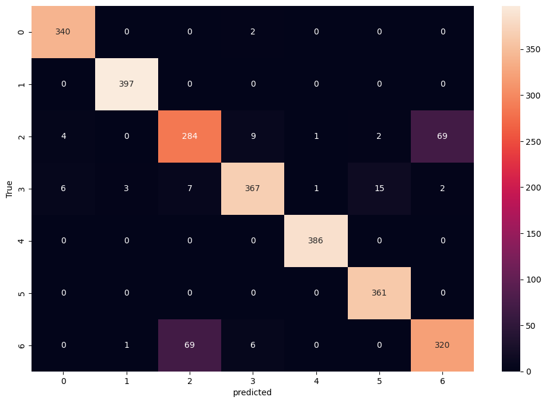

# Mental Health Text Classification using BERT

This project fine-tunes **BERT (bert-base-uncased)** to classify text statements into different mental health categories such as *Anxiety, Depression, Stress,* etc.  
The model is trained using **Hugging Face Transformers**, **PyTorch**, and **scikit-learn**.

---

##  Overview

The aim of this project is to detect emotional or mental health states from textual input.  
It includes text preprocessing, class balancing using RandomOverSampler, and fine-tuning of BERT for sequence classification.

---

##  Installation

Before running, ensure the following compatible library versions are installed:

```bash
!pip uninstall -y scikit-learn imbalanced-learn
!pip install scikit-learn==1.3.2 imbalanced-learn==0.11.0
```
## Libraries Used
    pandas
    numpy
    transformers
    torch
    datasets
    nltk
    scikit-learn
    imbalanced-learn
    matplotlib
    seaborn

## Dataset
### File Used: /content/drive/MyDrive/Combined Data.csv

Columns:

-***statement*** → Input text

-***status*** → Target class label (mental health category)

## Data Preprocessing Steps
  Converted text to lowercase
  Removed punctuation and non-alphabetic characters
  Removed English stopwords using NLTK
  Balanced classes using RandomOverSampler
  Encoded target labels with LabelEncoder
  Tokenized text using BertTokenizer

## 🤖 Model Configuration

| Parameter | Value |
|------------|--------|
| Base Model | bert-base-uncased |
| Framework | Hugging Face Transformers |
| Learning Rate | 2e-5 |
| Epochs | 5 |
| Train Batch Size | 16 |
| Eval Batch Size | 16 |
| Weight Decay | 0.01 |
| Warmup Steps | 500 |
| Gradient Accumulation | 2 |
| Evaluation Strategy | per epoch |


## 📊 Evaluation Results

### **Classification Report**

| Label | Precision | Recall | F1-Score | Support |
|--------|------------|---------|-----------|----------|
| Anxiety | 0.97 | 0.99 | 0.98 | 342 |
| Bipolar | 0.99 | 1.00 | 0.99 | 397 |
| Depression | 0.79 | 0.77 | 0.78 | 369 |
| Normal | 0.96 | 0.92 | 0.94 | 401 |
| Personality Disorder | 0.99 | 1.00 | 1.00 | 386 |
| Stress | 0.96 | 1.00 | 0.98 | 361 |
| Suicidal | 0.82 | 0.81 | 0.81 | 396 |

**Overall Accuracy:** 0.93  
**Macro Avg:** Precision = 0.92 | Recall = 0.93 | F1-Score = 0.93  
**Weighted Avg:** Precision = 0.92 | Recall = 0.93 | F1-Score = 0.93


## Output Visualizations
  


## Summary
The model achieves 93% accuracy in multi-class classification of mental health categories, demonstrating strong contextual understanding from BERT fine-tuning.
